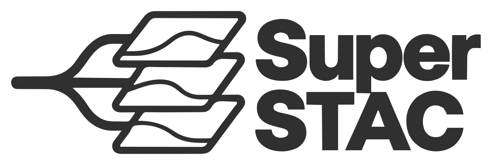

# SuperSTAC (Python)

<p align="center">
  <picture>
    <source media="(prefers-color-scheme: dark)" srcset="../../docs/assets/superstac-logo-dark.svg">
    <source media="(prefers-color-scheme: light)" srcset="../../docs/assets/superstac-logo.svg">
    
  </picture>
</p>

Python bindings for [superstac](https://github.com/spatialnode/superstac) —
federated STAC search across multiple catalogs.

> **Status: alpha.** APIs are not yet stable. Pre-1.0; expect breaking changes.

`superstac` ships a sync `Client` (drop-in for `pystac_client.Client` in most
code) and an `AsyncClient` for asyncio users.

## Install

```bash
pip install superstac
```

Or from source:

```bash
git clone https://github.com/spatialnode/superstac
cd superstac/crates/python
pip install maturin
maturin develop
```

## Quickstart

### Drop-in for pystac-client (single catalog)

```python
from superstac import Client

client = Client.open("https://earth-search.aws.element84.com/v1")

search = client.search(
    collections=["sentinel-2-l2a"],
    bbox=[6.0, 49.0, 7.0, 50.0],
    datetime="2024-01-01/2024-01-31",
    limit=50,
)

for item in search.items():
    print(item["id"], item["properties"]["datetime"])

print(search.matched(), "items")
fc = search.as_geojson()    # GeoJSON FeatureCollection dict
```

### Federated across multiple catalogs

Pass a YAML-shaped dict in one call:

```python
from superstac import Client

client = Client({
    "catalogs": [
        {"id": "earth-search", "url": "https://earth-search.aws.element84.com/v1"},
        {"id": "microsoft",    "url": "https://planetarycomputer.microsoft.com/api/stac/v1"},
    ],
    "settings": {"deduplicate_items": True, "max_concurrent_catalogs": 8},
})
client.start()

search = client.search(collections=["sentinel-2-l2a"], limit=50)
items = list(search.items())
print(search.metadata)   # per-catalog stats: queried, succeeded, failed, dedupes
```

Or build it up incrementally (any combination is fine):

```python
client = Client()
client.add_catalogs([
    {"id": "earth-search", "url": "https://earth-search.aws.element84.com/v1"},
    {"id": "microsoft",    "url": "https://planetarycomputer.microsoft.com/api/stac/v1"},
])
client.update_settings({"deduplicate_items": True})
client.start()
```

### Async

```python
import asyncio
from superstac import AsyncClient

async def main():
    client = await AsyncClient.open("https://earth-search.aws.element84.com/v1")
    search = await client.search(collections=["sentinel-2-l2a"], limit=50)
    for item in search.items():
        print(item["id"])
    await client.shutdown()

asyncio.run(main())
```

### Load from YAML

```python
client = Client.from_yaml("superstac.yml")          # sync
client = AsyncClient.from_yaml("superstac.yml")     # async
```

## License
MIT.
