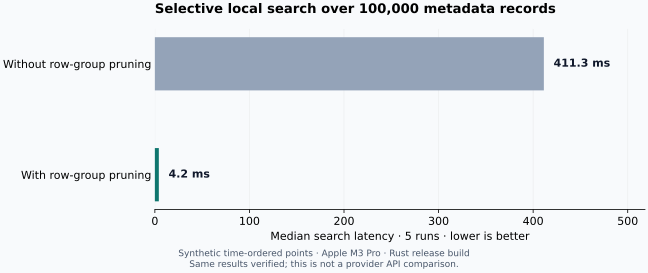

## Less metadata to decode

For a selective time query over **100,000 synthetic STAC items**, local search took
**4.2 ms with row-group pruning**, compared with **411.3 ms without it** in this run.
Both paths used the same bounded decoder and returned identical records.



| Measurement | Value |
| --- | --- |
| Fixture | 100,000 time-ordered point items, one collection |
| File size | 858,390 bytes; minimal, highly compressible metadata |
| Layout | 1,024 rows per group |
| Query | The last 20 records by acquisition-time filter; no sorting |
| Statistic | Median of five sequential runs; OS cache may be warm |
| Environment | Apple M3 Pro, 36 GiB RAM, macOS 15.5, Rust 1.88.0 |
| Build | SuperSTAC v0.3 development code, optimized release profile |
| Recorded | October 2, 2026 |

The baseline decodes row groups sequentially until the result limit. The optimized
path consults Parquet statistics and skips groups that cannot match. The benchmark
asserts that the returned IDs are identical on every repetition.

## What this means for your workflow

Time-ordered metadata can make repeated, selective time searches much cheaper.
This is useful when exploring an already saved inventory. It does **not** show
that SuperSTAC is faster than a provider API: no remote API was measured, and
initial ingestion time is excluded.

This fixture is a favorable pruning case, not a production Sentinel archive.
Broad queries, complex geometry, large asset dictionaries, sorting, scope unions,
and incremental overlays can cost more. Unions and overlays disable pruning until
safe to filter without resurrecting old item versions; compacting an incremental
scope resolves its overlays. Deduplication retains item keys in memory.

## Reproduce it

```sh
cargo test -p superstac-geoparquet --release benchmark_scoped_search -- --ignored --nocapture
```

The fixture is generated locally and removed afterward. There are no provider
requests. Output includes the item count, file bytes, and both median latencies.
Increase `SUPERSTAC_BENCH_ITEMS` only when you have enough memory: fixture generation
currently materializes the synthetic items, unlike the bounded ingestion buffers.

[Download measurements as JSON](/superstac/benchmarks/geoparquet-v0.3.json) ·
[Download the figure](/superstac/benchmarks/geoparquet-v0.3.png) ·
[Plotting script](https://github.com/spatialnode/superstac/blob/main/scripts/plot-geoparquet-benchmark.py)

Start with the [GeoParquet notebook](/docs/python/geoparquet-notebook) or read the
[dataset guide](/docs/guides/geoparquet) before measuring your own inventory.
